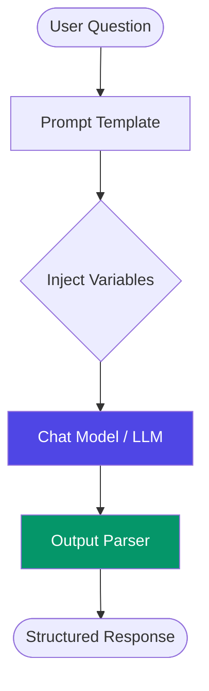
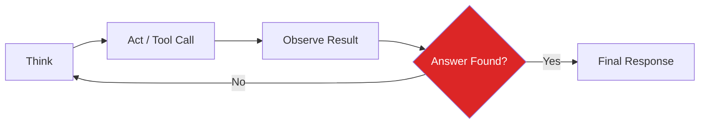
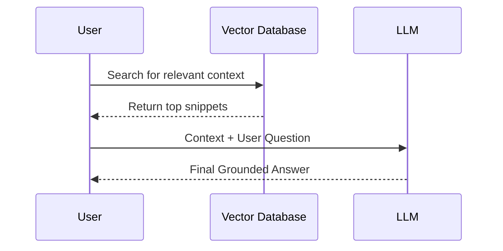

# 🤖 AI LEARNING | A Knowledge Sharing Journey

### "Learning and improving skills by oneself is good, but sharing our knowledge with others is the best." 🤝✨

---

## 🌟 Vision & Philosophy
I believe that AI should not be a "Black Box." This project was created specifically to help learners understand the **inner mechanics** of modern AI Agents. By sharing this repository, I hope to empower everyone to build, learn, and improve together.

---

## 🏗️ Architectural Flow: How it Works
This project follows a modular path from simple LLM calls to autonomous reasoning.

### 1. The Core Application Flow
Every AI interaction in this project follows the **LangChain Expression Language (LCEL)** standard:



### 2. The Agentic "ReAct" Loop (Module 07)
Unlike static chains, our agents can **loop and think**:



### 3. RAG Pipeline (Module 08)
How the AI learns from your private data:



---

## ⚡ The 9 Stages of Mastery

| Module | Goal | Concept Taught |
|:---|:---|:---|
| `01` | **First Steps** | Sending your first message to a model. |
| `02` | **Personas** | Creating reusable AI characters with Templates. |
| `03` | **Chaining** | Connecting multiple steps into a pipeline. |
| `04` | **Safety** | Forcing AI to return valid JSON/Pydantic code. |
| `05` | **Memory** | Building a brain that remembers previous turns. |
| `06` | **Skills** | Giving AI tools to calculate or search the web. |
| `07` | **Agency** | The "Think-Act-Repeat" autonomous logic. |
| `08` | **Grounding** | Connecting AI to your own private document library. |
| `09` | **Product** | **Research Assistant:** Combining everything. |

---

## 🚀 Getting Started on GitHub

### Local Development Setup
1. **Clone & Environment**
   ```bash
   git clone https://github.com/parthibanktech/ai-learning-langchain-agents.git
   cd ai-learning-langchain-agents
   python -m venv venv
   source venv/bin/activate  # Windows: venv\Scripts\activate
   ```

2. **Configuration**
   ```bash
   pip install -r requirements.txt
   copy .env.example .env   
   # Add your OPENAI_API_KEY to .env
   ```

3. **Explore the Lab Locally**
   The best way to learn is by doing. Open `index.html` in your browser to launch the **Interactive Learning Dashboard**!

---

## ☁️ Cloud Deployment (Render via Docker)
This project is configured out-of-the-box to be deployed for **free** on [Render Cloud](https://render.com) using the included `Dockerfile` and ultra-fast Nginx container.

1. Create an account on **Render.com**.
2. Click **New +** -> **Web Service**.
3. Connect your GitHub and select this repository (`ai-learning-langchain-agents`).
4. Set the **Environment** to `Docker` and instance type to `Free`.
5. Click **Deploy**. Your dashboard will be live online in 2 minutes!

---

## 🛡️ Educational Disclaimer
> [!IMPORTANT]
> This project is shared purely for **EDUCATIONAL PURPOSES.** It is designed to assist the community in learning LangChain 1.x and LangGraph methodologies. 

---

## 🤝 Pass it Forward
I prepared this because I want to share my knowledge. If you learn something new today, **share it with one other person.** That is how we grow!

*"Knowledge is the only thing that grows when shared."* 🚀

---
*Built with ❤️ for the AI Community | February 2026*


